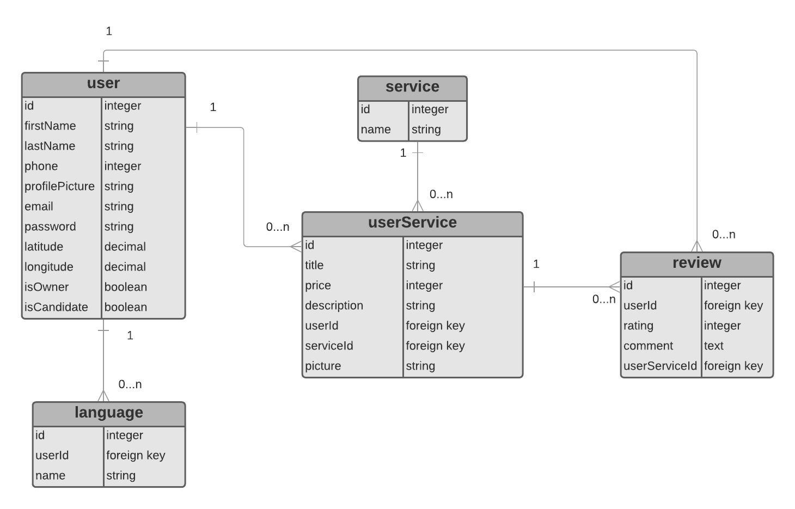

# 🐶🐱Fluffy World Server🐩🦮

Fluffy World is an application that allows pet lovers to search for pet services and pet friends near their location. You can find the perfect candidate and be sure that your fluffy friend is in right hands. You can contact them by email to ask for more details.

## Table of contents:

- **[Data base](#data-base)**
- **[Client](#client)**
- **[Endpoints](#endpoints)**
- **[Technologies used](#technologies-used)**
- **[Git workflow](#git-workflow)**

## Data base

Diagram of data models:

## Client

**[Here](https://github.com/paula-morales/fluffy-world-client)** you can find the server repository for this project.

## Endpoints

| Method | Path                                              | Purpose                                         | required parameters                                                          | auth |
| ------ | ------------------------------------------------- | ----------------------------------------------- | ---------------------------------------------------------------------------- | ---- |
| POST   | '/signup'                                         | Create a new user and get a token               | name,longitude,latitude,phone,email, password,isOwner,isCandidate, languages | no   |
| POST   | '/login'                                          | Get a token with email & password               | email, password                                                              | no   |
| GET    | '/me'                                             | Get information of this user                    | none                                                                         | yes  |
| GET    | '/userservice'                                    | Get all profiles of userservice                 | none                                                                         | no   |
| GET    | '/userservice/:serviceId/:latOwner/:lngOwner/:km' | Get profiles near by one latitude and longitude | serviceId, latitudOwner, longitudOwner,km                                    | no   |
| POST   | '/userservice/contact'                            | Contact one candidate by email                  | mailToId, date, time, message, serviceId                                     | yes  |
| POST   | '/userservice/registerpet'                        | Add a new pet profile                           | name, description, picture                                                   | yes  |
| POST   | '/userservice/registerservice'                    | Add a new service profile                       | title, price, description, picture, serviceId                                | yes  |
| GET    | '/user/:userId'                                   | Get a user by id                                | userId                                                                       | no   |
| GET    | '/favorites'                                      | Get favorites by user logged in                 | none                                                                         | yes  |
| POST   | '/favorites/add'                                  | Add a new favorite                              | idUserService                                                                | yes  |
| DELETE | '/favorites/remove/:favoriteId'                   | Remove from favorites                           | none                                                                         | yes  |

## Technologies used

- Express
- REST API
- PostgreSQL, Sequelize ORM
- nodemailer

## Git workflow

In this project I try to use:

- Good commit messages
- Well named branches
- Pull requests with summaries
